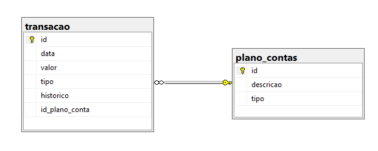

## My Finance Web App
MyFinance - Projeto do Curso de Pós Graduação em Engenharia de Software da PUC-MG

### 💻 Arquitetura
A figura abaixo representa a modelagem lógica do banco de dados da aplicação no modelo de DER - Diagrama de Entidades e Relacionamentos.

