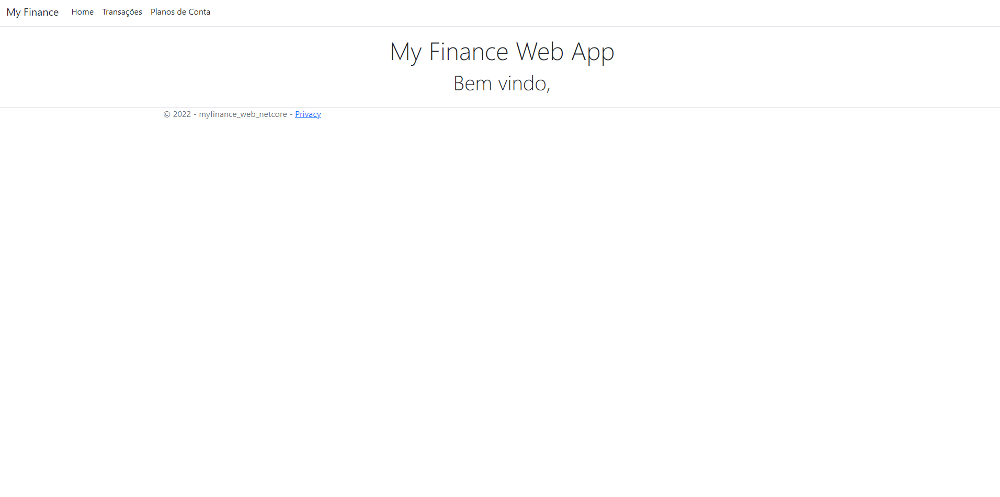
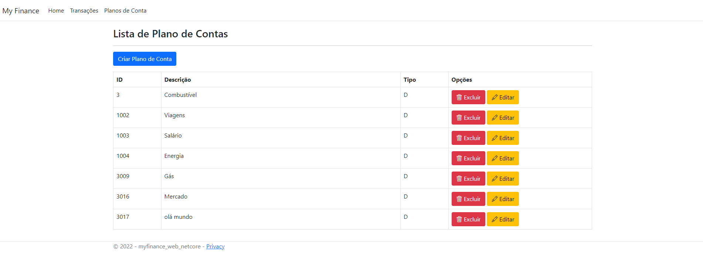
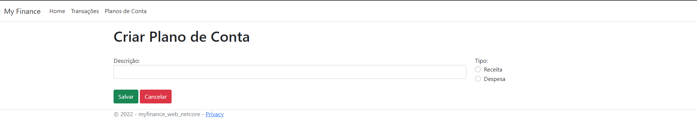
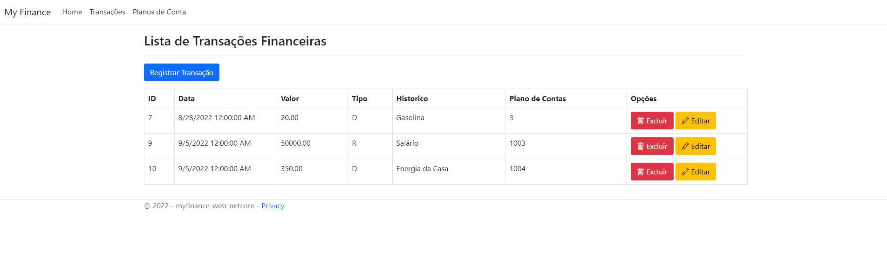
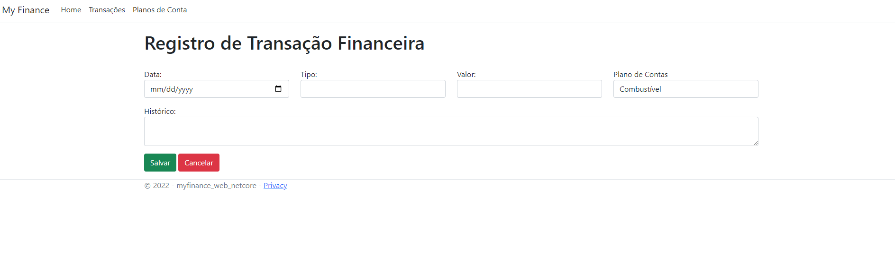

## My Finance Web App
MyFinance - Projeto do Curso de Pós Graduação em Engenharia de Software da PUC-MG

🟢 <b>Arquitetura do banco de dados<b />

A figura abaixo representa a modelagem lógica do banco de dados da aplicação no modelo de DER - Diagrama de Entidades e Relacionamentos.

O estrutura do banco de dados foi criada com duas tabelas:

- plano_contas: Essa tabela é responsável em armazenar os registros de planos de contas como por exemplo: Salário, Combustível, etc..
  - Campos:
    - id: código do registro, chave primária na tabela.
    - descricao: descrição do plano de contas.
    - tipo: tipo do plano de contas (R para Receita, D para Despesa).
  
- transacao: Essa tabela é responsável em armazenar as transações de fato, por exemplo, recebimento do salário, ela possui um relacionamento com a tabela de plano_contas, onde o id plano de contas é chave estrangeira na tabela de transacao.
  - Campos:
    - id: código do registro, chave primária na tabela.
    - data: a data em que a transação foi realizada.
    - valor: o valor da transação.
    - tipo: tipo da transação (R para Receita, D para Despesa).
    - historico: campo para informar um histórico da transação.
    - id_plano_conta: é a referencia para a tabela de plano_contas.

🟢 <b>Arquitetura da Aplicação<b />

A aplicação foi desenvolvida utilizando como arquitetura o padrão MVC, Model, View, Controller. Para a criação da aplicação foi utilizado o .Net Core 6.

🟢 <b>Ferramentas Utilizadas<b />
  - Sql Server Management Studio 18
  - Visual Studio Community 2022
  
🟢 <b>Como Executar o Projeto<b />
  - Basta clonar o projeto e abri-lo no Visual Studio Code ou no Visual Studio Community 2022.
  - Rodar o script para a criação do banco de dados (Encontrado em docs/database.sql).

🟢 <b>Telas da Aplicação<b />
  
  - Tela Inicial

  

  - Tela de Listagem de Plano de Contas

  

  - Tela de Cadastro de Plano de Contas

  

  - Tela de Listagem de Transações
  
  

  - Tela de Cadastro de Transações
  
  